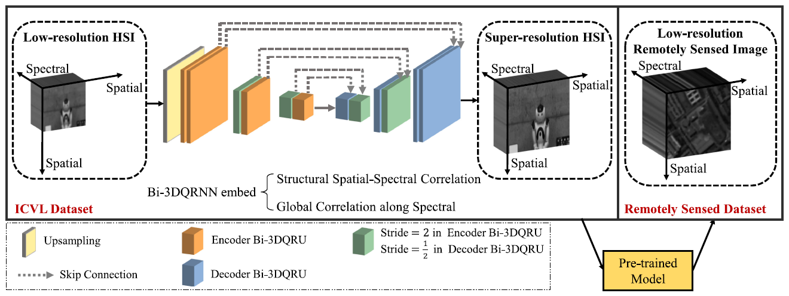
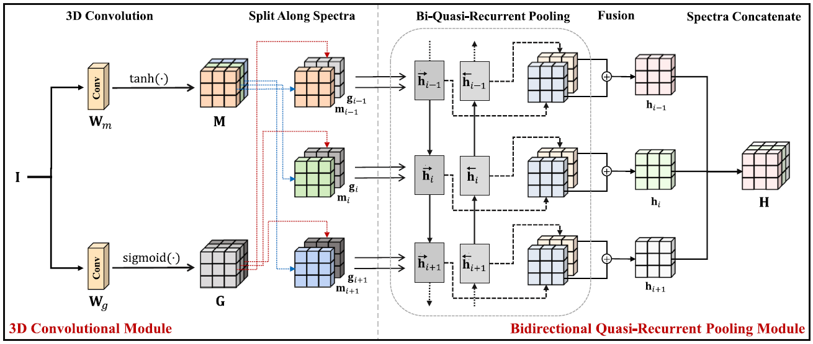
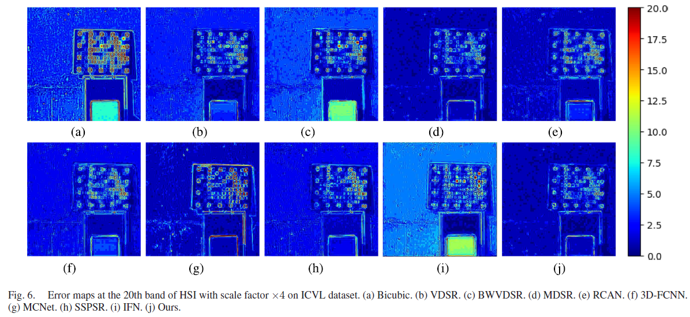

# Bi-3DQRNN
The PyTorch implementation of [this paper](https://ieeexplore.ieee.org/document/9351612).

**Bidirectional 3D Quasi-Recurrent Neural Network for Hyperspectral Image Super-Resolution (J-STARS 2021)**.

[Ying Fu](https://ying-fu.github.io/), [Zhiyuan Liang](http://zhiyuan0112.github.io/) and [Shaodi You](https://youshaodi.github.io/).

## Introduction
In this article, we design a bidirectional 3D quasi-recurrent neural network for HSI super-resolution with arbitrary number of bands. Specifically, we introduce a core unit that contains a 3D convolutionalmodule and a bidirectional quasi-recurrent pooling module to effectively extract structural spatial-spectral correlation and global correlation along spectra, respectively. By combining domain knowledge of HSI with a novel pretraining strategy, our method can be well generalized to remote sensing HSI datasets with limited number of training data.

### Network Architecture
* The overall architecture of Bi-3DQRNN

   
   
* The core unit of Bi-3DQRNN, named Bi-3DQRU

   

## Prerequisites
* Python >=3.6, PyTorch >= 1.7.1
* Requirements: opencv-python, tensorboardX, caffe

## Getting Started

### 1. Preparing training/testing datasets
* HSIs in the visible range for the natural scenes.

  [ICVL](http://icvl.cs.bgu.ac.il/hyperspectral/). We only need ```.mat``` version.

* Remote sensed image data.

  [Pavia Center, Pavia University, Salinas Valley, Indian Pines](http://www.ehu.eus/ccwintco/index.php/Hyperspectral_Remote_Sensing_Scenes) and [Urban](https://rslab.ut.ac.ir/data)

### 2. Generating training data
```bash
python utility/lmdb_data.py
```

### 3. Training
```bash
python hsi_sr.py -a biqrnn_16_5
```

### 4. Testing
```bash
python hsi_test.py -a biqrnn_16_5 -r -rp /path/to/the/model
```

## Result
  
  

## Citation
If you find this work useful for your research, please cite: 
```bibtex
@ARTICLE{ying2021bidirectional,
  author={Fu, Ying and Liang, Zhiyuan and You, Shaodi},
  journal={IEEE Journal of Selected Topics in Applied Earth Observations and Remote Sensing}, 
  title={Bidirectional 3D Quasi-Recurrent Neural Network for Hyperspectral Image Super-Resolution}, 
  year={2021},
  volume={14},
  pages={2674-2688},
}
```

